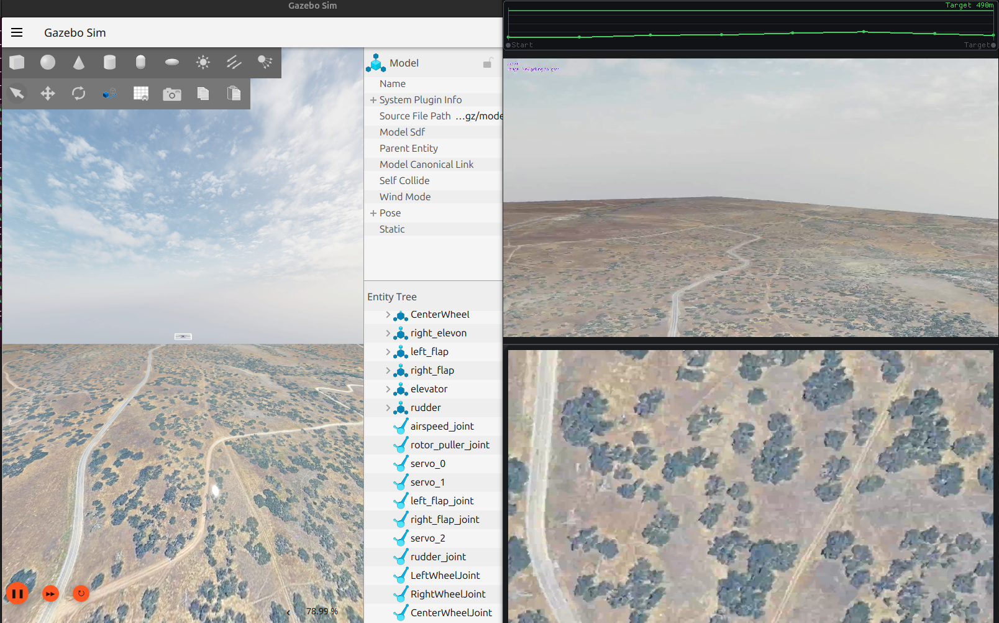

# GstPlaneCameraSystem

[](https://github.com/Xovium-Tech/px4-gazebo-gstreamer-camera-plugin/actions/workflows/build.yml)
[](https://github.com/Xovium-Tech/px4-gazebo-gstreamer-camera-plugin/releases/latest)

Direct low-latency H.264 camera streaming for PX4 SITL with
**Gazebo Harmonic and Gazebo Jetty**.

`GstPlaneCameraSystem` reads RGB frames directly from Gazebo's rendering
camera and sends them to GStreamer without routing camera images through
Gazebo Transport.

It supports multiple cameras on the same simulated vehicle, with independent
UDP destinations, frame rates, bitrates, and encoder settings.



## Features

- Direct `Camera::Copy()` → GStreamer frame path
- Multiple simultaneous camera streams
- Independent UDP destination, frame rate, bitrate, and encoder settings per camera
- RTP/H.264 output
- x264 software encoding
- Optional NVIDIA `nvh264enc` with automatic x264 fallback
- Dynamic camera discovery, removal, and respawn handling
- Gazebo Harmonic and Jetty from the same source tree

## Compatibility

| Gazebo | `gz-sim` | `gz-rendering` | `gz-plugin` | Build |
| --- | ---: | ---: | ---: | --- |
| Harmonic | 8 | 8 | 2 | `-DGZ_DISTRO=harmonic` |
| Jetty | 10 | 10 | 4 | `-DGZ_DISTRO=jetty` |

Harmonic and Jetty binaries are **not ABI-compatible**. Build or download
the package matching your Gazebo distribution.

Both builds produce `libGstPlaneCameraSystem.so` and export
`custom::GstPlaneCameraSystem`. Use a separate build directory for each
and expose only the matching binary in your plugin search path.

## Quick start

Install the [dependencies](#dependencies) for your Gazebo distribution, then
run these commands from the repository root. PX4 is not a build dependency.

### Jetty

```bash
cmake -S . -B build-jetty \
  -DGZ_DISTRO=jetty \
  -DCMAKE_BUILD_TYPE=Release
cmake --build build-jetty -j"$(nproc)"

export GZ_SIM_SYSTEM_PLUGIN_PATH="$PWD/build-jetty${GZ_SIM_SYSTEM_PLUGIN_PATH:+:$GZ_SIM_SYSTEM_PLUGIN_PATH}"
```

### Harmonic

```bash
cmake -S . -B build-harmonic \
  -DGZ_DISTRO=harmonic \
  -DCMAKE_BUILD_TYPE=Release
cmake --build build-harmonic -j"$(nproc)"

export GZ_SIM_SYSTEM_PLUGIN_PATH="$PWD/build-harmonic${GZ_SIM_SYSTEM_PLUGIN_PATH:+:$GZ_SIM_SYSTEM_PLUGIN_PATH}"
```

The libraries are created at `build-jetty/libGstPlaneCameraSystem.so` and
`build-harmonic/libGstPlaneCameraSystem.so`. An omitted `GZ_DISTRO` defaults
to Harmonic. CMake rejects switching distributions in an existing build cache.

Continue with a [standalone example](#standalone-examples) or the
[PX4 setup](#px4-integration).

## Dependencies

Install the development packages for **one** Gazebo distribution: [Harmonic installation](https://gazebosim.org/docs/harmonic/install_ubuntu/) or [Jetty installation](https://gazebosim.org/docs/jetty/install_ubuntu/). On Ubuntu 24.04 the corresponding collections are `gz-harmonic` and `gz-jetty`. Jetty's installed CMake configuration may use unversioned package and imported target names; CMake resolves the exported targets and verifies their major versions.

Common build dependencies:

```bash
sudo apt update
sudo apt install -y build-essential cmake pkg-config \
  libgstreamer1.0-dev libgstreamer-plugins-base1.0-dev
```

Runtime software encoding and the optional inspection/viewer commands:

```bash
sudo apt install -y gstreamer1.0-tools \
  gstreamer1.0-plugins-base gstreamer1.0-plugins-good \
  gstreamer1.0-plugins-bad gstreamer1.0-plugins-ugly gstreamer1.0-libav

gst-inspect-1.0 x264enc
gst-inspect-1.0 nvh264enc  # Optional NVIDIA encoder
```

The GStreamer command-line tools are not required to compile the library. No CUDA SDK or GPU is required to build it or run the normal core tests.

## Standalone examples

Each world is self-contained, with Physics, UserCommands, Sensors using Ogre2, the stream system, a ground plane, a visible target, and two cameras. No PX4 checkout, downloaded models, or external meshes are needed. `camera_front` sends to port `5606` at 30 FPS / 16384 kbit/s; `camera_down` sends to port `5604` at 15 FPS / 4096 kbit/s.

In a Harmonic terminal:

```bash
export GZ_SIM_SYSTEM_PLUGIN_PATH="$PWD/build-harmonic${GZ_SIM_SYSTEM_PLUGIN_PATH:+:$GZ_SIM_SYSTEM_PLUGIN_PATH}"
gz sim -s -r --headless-rendering examples/harmonic/world.sdf
```

Or, in a separate Jetty terminal:

```bash
export GZ_SIM_SYSTEM_PLUGIN_PATH="$PWD/build-jetty${GZ_SIM_SYSTEM_PLUGIN_PATH:+:$GZ_SIM_SYSTEM_PLUGIN_PATH}"
gz sim -s -r --headless-rendering examples/jetty/world.sdf
```

Use only the matching build path; do not add both directories to `GZ_SIM_SYSTEM_PLUGIN_PATH`. Headless rendering still needs a usable Ogre2 renderer and graphics drivers. For interactive inspection, omit `-s --headless-rendering`.

The standalone worlds embed their systems. The accompanying `server.config` files show equivalent ordering for applications that load systems from a server configuration; do not load the same world system twice.

## PX4 integration

In your PX4 checkout, edit:

```text
src/modules/simulation/gz_bridge/server.config
```

Replace the existing default streamer entry:

```xml
<plugin entity_name="*" entity_type="world"
        filename="libGstCameraSystem.so"
        name="custom::GstCameraSystem"/>
```

with the following, **after the Sensors system**:

```xml
<plugin entity_name="*" entity_type="world"
        filename="gz-sim-sensors-system" name="gz::sim::systems::Sensors">
  <render_engine>ogre2</render_engine>
</plugin>
<plugin entity_name="*" entity_type="world"
        filename="libGstPlaneCameraSystem.so"
        name="custom::GstPlaneCameraSystem"/>
```

Keep the existing Sensors entry and replace only the streamer entry; the expanded example illustrates their order. The custom entry is identical for Harmonic and Jetty. Launch PX4 from the terminal with the matching `GZ_SIM_SYSTEM_PLUGIN_PATH` exported, using a PX4 revision/model target that supports your simulator. For example, an existing Harmonic PX4 setup may use `make px4_sitl gz_rc_cessna`.

This plugin's original implementation was tested with PX4 v1.16 and Harmonic. That historical result does not constitute flight testing of this refactor or Jetty integration. The top-level `examples/model.sdf` and `examples/server.config` are retained as the original PX4 examples; the distribution-specific examples are the portable standalone starting points.

## Camera configuration

Add this configuration block to each camera sensor. In modern Gazebo the sensor block supplies configuration to the single world system; each sensor does not own a separate GStreamer system instance.

```xml
<sensor name="camera_front" type="camera">
  <always_on>true</always_on>
  <update_rate>30</update_rate>
  <visualize>false</visualize>
  <camera>
    <horizontal_fov>1.0</horizontal_fov>
    <image><width>1920</width><height>1080</height><format>R8G8B8</format></image>
    <clip><near>0.05</near><far>6000</far></clip>
  </camera>
  <plugin filename="libGstPlaneCameraSystem.so" name="custom::GstPlaneCameraSystem">
    <camera_name>camera_front</camera_name>
    <udp_host>127.0.0.1</udp_host>
    <udp_port>5606</udp_port>
    <rate>30</rate>
    <bitrate_kbps>16384</bitrate_kbps>
    <use_cuda>false</use_cuda>
    <x264_speed_preset>1</x264_speed_preset>
  </plugin>
</sensor>
```

Images must be `R8G8B8`. Unsupported formats are rejected, never reinterpreted as RGB. Add sensors with distinct names and UDP ports for additional streams. Cameras appearing after startup are discovered dynamically; removing a camera stops its pipeline, and respawning it creates a fresh independent stream.

| Parameter | Default | Validation / meaning |
| --- | --- | --- |
| `camera_name` | sensor name | Rendering camera name, optionally scoped |
| `udp_host` | `PX4_VIDEO_HOST_IP`, otherwise `127.0.0.1` | Explicit nonempty SDF host overrides the environment |
| `udp_port` | `5600` | Invalid values outside `1..65535` reset to `5600` |
| `rate` | rounded sensor update rate, otherwise `30` | Clamped to `1..240` FPS |
| `bitrate_kbps` | `16384` | Clamped to `64..200000` kbit/s |
| `use_cuda` | `false` | Attempt `nvh264enc`, with x264 fallback |
| `x264_speed_preset` | `1` | Clamped to `1..10` |

To choose a default remote destination, omit `udp_host` and set:

```bash
export PX4_VIDEO_HOST_IP=192.168.1.100
```

## View a stream

```bash
gst-launch-1.0 -v \
  udpsrc port=5606 caps="application/x-rtp,media=video,encoding-name=H264,payload=96" \
  ! rtph264depay ! h264parse ! avdec_h264 ! videoconvert \
  ! autovideosink sync=false
```

Use port `5604` in another receiver for the second example camera.

## Encoding and recovery

`use_cuda=true` attempts NVIDIA `nvh264enc`. If the encoder is absent, cannot
initialize, or fails at runtime, that stream falls back to x264. Other cameras
retain their own encoder and pipeline state.

Fatal GStreamer errors and EOS stop the affected pipeline and schedule a retry
after one second. RGB conversion to I420 for x264 or NV12 for NVENC runs on the
CPU; `use_cuda` does not make the frame path zero-copy.

## Install

Choose one distribution for a given prefix. For example:

```bash
cmake --install build-jetty --prefix "$HOME/.local"
export GZ_SIM_SYSTEM_PLUGIN_PATH="$HOME/.local/lib${GZ_SIM_SYSTEM_PLUGIN_PATH:+:$GZ_SIM_SYSTEM_PLUGIN_PATH}"
```

The default install directory follows CMake's normal library directory, usually `lib`; if your platform uses `lib64`, adjust the exported path or configure `-DCMAKE_INSTALL_LIBDIR=lib`. Installing a second distribution to the same prefix would overwrite the identically named binary. Use separate prefixes to retain both and expose only the matching prefix to Gazebo.

## Testing

The following results were verified locally on 2026-09-16. The CI badge shows
the current workflow status; a skipped runtime test does not establish runtime
compatibility.

| Check | Harmonic | Jetty |
| --- | --- | --- |
| Compilation and correct library linkage | Passed | Passed |
| Direct RGB camera frames reaching appsrc | Passed with a native server harness | Passed with `gz sim` |
| Camera removal and respawn | Not runtime-tested | Passed |
| Unsupported-format rejection while another camera streams | Not runtime-tested | Passed |
| Hardware NVENC encoding | Not validated; optional test skipped | Not validated; optional test skipped |
| Manual PX4 flight | Not tested | Not tested |

Both distributions have runtime camera evidence; Harmonic's standard CLI launch
and dynamic camera lifecycle remain unverified. The Harmonic harness used a
relocated dependency tree, versioned Ogre2, and Bullet physics.

Run the default checks in the matching environment:

```bash
ctest --test-dir build-jetty --output-on-failure
# Or, in the Harmonic environment:
ctest --test-dir build-harmonic --output-on-failure
```

The detailed tests cover configuration, environment overrides, real GStreamer
element settings, buffer ownership, timestamps, packed RGB row strides, encoded
RTP output, independent streams, error/EOS retries, fallback, and concurrent
shutdown. See [TESTING.md](docs/TESTING.md) for the full coverage, core-only
builds, rendering smoke tests, dynamic camera tests, and recorded limitations.

## Architecture

One Gazebo Sim adapter handles discovery, SDF parsing, simulation-time capture
scheduling, and rendering callbacks for both distributions. Each camera has an
independent simulator-neutral GStreamer pipeline.

```text
Gazebo rendering camera → Camera::Copy() → owned frame buffer
    → appsrc → video conversion → H.264 encoder → RTP / UDP
```

The core copies image bytes into GStreamer-owned memory before returning from
the rendering callback. Its worker never retains Gazebo camera pointers or
borrowed image buffers. See [ARCHITECTURE.md](docs/ARCHITECTURE.md) for the source
layout, buffer ownership, and stream lifecycle.

## License

BSD 3-Clause. Derived from the [PX4-Autopilot Gazebo GStreamer camera plugin](https://github.com/PX4/PX4-Autopilot/tree/v1.16.0/src/modules/simulation/gz_plugins/gstreamer).

Original PX4 implementation: Copyright (c) 2025 PX4 Development Team. Modifications in this repository: Copyright (c) 2026 Alex Chazov. See [LICENSE](LICENSE).
